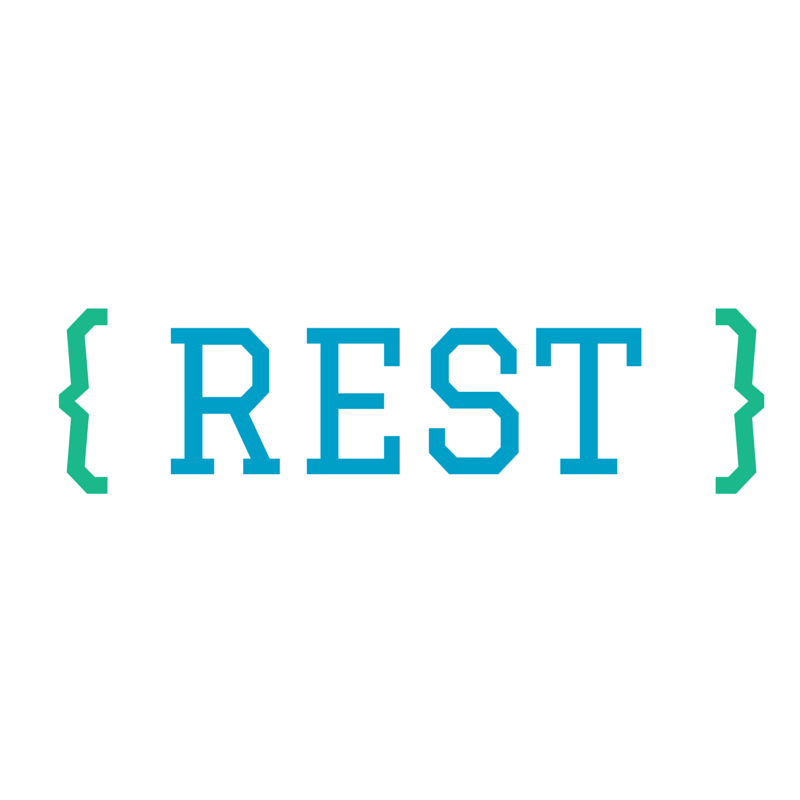
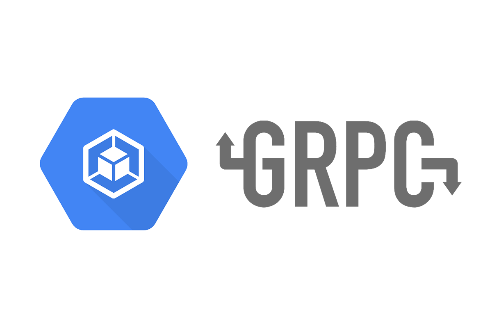
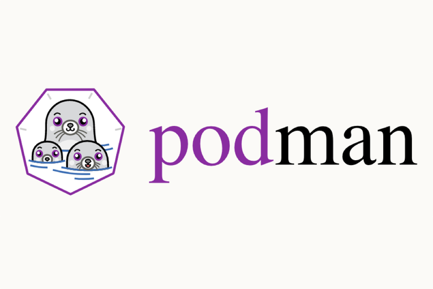
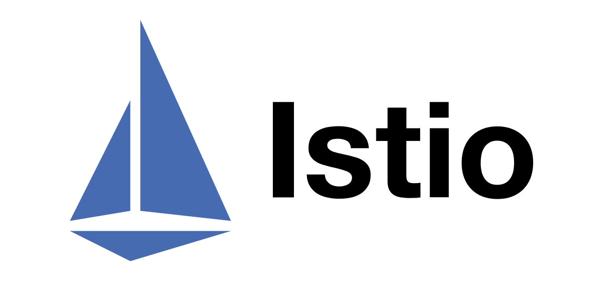

 
 <!-- Contact Section -->
<h1 align="center">Connect With Me </h1> 

<!-- End of Contact Section -->

<!-- about me section -->
<h1 align="center">About Me</h1>
<h3>
I am a Back-End Engineer with industry experience in building websites and web applications. Specialist in Python Django Framework.
</h3>
<h3>
I also have experience in FastApi, Svelte, Go Lang, Rest Api, Graphql, Docker, React, Websocket, DevOps, Kubernates, Server, AWS, Linux, Virtualization, and Cloud Computing on multiple projects.
</h3>
<h3>
Detailed-oriented, responsible, committed engineer, With a get-it-done, on-time, and high-quality product spirit. Self-quick learner, self-motivated, social and best for Tech Lead.
</h3>

<!-- End of about me section -->

<!-- Experience Section -->
<h1 align="center">My Experience</h1>
<h2>Languages: </h2>

<h2>Frameworks: </h2>

<h2>API: </h2>

<h2>Containers: </h2>

<h2>Cloud Computing: </h2>

<h2>Database: </h2>

<h2>Server, Reverse Proxy, Loadbalancer, Service Mesh: </h2>

<!--End of Experience Section -->

## By the way here are some of my statistics 🚀

